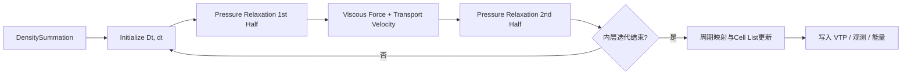

# 三维泊肃叶槽道流技术报告（汇报版）

> 面向会议汇报与幻灯展示，概述 `test_3d_channel_flow` 案例的核心思路、实现要点与验证结果。详尽推导与源码行号请参见 `technical_report_revised.md`。2025-10-22 已完成沿 `-x` 的 100 s 仿真（`flow_direction_body = -1.0`），核心指标：`u_peak ≈ -1.5305` (|u| ≈ 1.5305)、`u_steady ≈ -1.5265`、壁面 RMS ≈ 0.0182、`max|v_y| ≈ 9.7×10⁻³`、`max|v_z| ≈ 1.1×10⁻²`、TickCount ≈ 1669 s。额外进行了“初速 +x、体力 -x”的一致性测试，详见第 6 节。

## 1. 案例概览
- **物理场景**：三维平板泊肃叶通道流，通道尺寸 `DL×DH×DW = 10×2×1`（x/z 周期，y 为壁面）。
- **仿真目标**：在 SPHinXsys 中复现 Re=100 的层流解，衡量中心线速度与壁面残差（当前沿 `-x`）。
- **驱动力设定**：恒定体力 `f_x = flow_direction · 12 μ U_bulk / (ρ H²)`，其中 `flow_direction = -1.0`，幅值保持 `U_bulk = 1.0`。
- **运行配置**：粒子间距 `h = 0.05`，总时间 `t_end = 100 s`，输出 200 帧。

## 2. 几何与粒子构建
- `ChannelGeometry` 继承 `ComplexShape`，构建移位长方体并置于域中心。
- 壁面粒子生成器：
  - 上下双层粒子，法向分别为 `(0,1,0)`、`(0,-1,0)`。
  - 流向延展 `20h`、展向延展 `4h`，缓解周期邻域截断。
- 观察体：中心线、壁法向、展向三组 `ObserverBody`，用于剖面与零流量验证。

## 3. 物性与初始条件
- 基准密度 `ρ₀ = 1.0`，动力粘度 `μ = 0.02`（Re=100），人工声速 `c = 10 U_bulk`（Ma≈0.1）。
- 初始速度：`InitialVelocity` 将流体速度设为 `(flow_direction · U_bulk, 0, 0)`，当前为 `(-1, 0, 0)`，缩短启动波动。
- 粒子体系：`SPHSystem` 关闭松弛流程，使用晶格初始化。

## 4. 动力学流程（核心模块）
| 模块 | 作用 | 关键类型 |
|------|------|----------|
| 密度求和 | 外层对流步前重建密度 | `DensitySummationComplex` |
| 时间步控制 | `Dt` 取对流/粘性最小值；声学子步自适应 | `AdvectionViscousTimeStep` / `AcousticTimeStep` |
| 压力松弛 | 黎曼解耦合壁面接触 | `Integration1stHalfWithWallRiemann` |
| 粘性耗散 | 内/外邻域对称梯度 + 壁面贡献 | `ViscousForceWithWall` |
| 输运速度修正 | 调整粒子体积守恒 | `TransportVelocityCorrectionComplex` |
| 周期映射 | 位置折返 + 邻域镜像 | `PeriodicConditionUsingCellLinkedList`（x/z） |

## 5. 时间积分与输出

- 输出内容：`ChannelFluid_*.vtp`、观测量 `.dat`、`TotalKineticEnergy.dat`、`timing_summary.txt`。

- **中心线速度**（`analysis.centerline_history`）  
  - 峰值 `u_max ≈ -1.5305` (|u| ≈ 1.5305) @ `t ≈ 96.45 s`；`u_mid` 稳态均值 ≈ `-1.5265` (|u| ≈ 1.5265)。  
  - 终端剖面误差：`max|err| ≈ 3.0×10⁻²`，`RMS ≈ 2.7×10⁻²`。
- **壁面零法向**（`WallNormalObserver_Velocity.dat`）  
  - `max|v_y| ≈ 9.7×10⁻³`，`max|v_z| ≈ 1.1×10⁻²`，RMS ≈ `1.82×10⁻²`，均低于 GTest 容差 `2×10⁻²`。
- **二维对比**（`compare_umax_2d_vs_3d.m`）  
  - 对齐符号后，3D 峰值低于 2D ≈ 2.4%，归因于展向邻域增加的粘性耗散。  
  - 形成 `umax_comparison.mat / .png`，用于展示差异。
- **GTest**：`laminar_profile` 校验中心线误差 `<0.05 U_bulk`、壁法向/展向 `<0.02`，全部通过。

## 6. 附加验证：初速 `(+1,0,0)` + 体力 `-x`
- 目的：检验周期边界在“初始动量与体力方向相反”时的稳定性。  
- 结果：`u_peak ≈ -1.5096` (|u| ≈ 1.5096)、`u_steady ≈ -1.4928`，中心线最大误差 ≈ `1.0×10⁻²`，RMS ≈ `7.2×10⁻³`；壁面 RMS ≈ `3.5×10⁻³`，`max|v_y| ≈ 1.15×10⁻²`，`max|v_z| ≈ 9.7×10⁻³`；计时 `TickCount ≈ 1567 s` / `steady_clock ≈ 1664 s`。  
- 结论：周期复制与壁面条件保持稳定，初始正向动量会在数十秒内自然翻转为体力决定的稳态。

## 7. 性能与资源
- 物理时间 100 s，对应 `TickCount ≈ 1669 s` / `steady_clock ≈ 1772 s`，平均每帧耗时 ≈ 9.0 s。  
- 粒子数 ≈ 160k（流体）+ 8k（壁面），输出：VTP ≈ 400 MB、`flow_data.mat ≈ 50 MB`、`channel_flow_animation.mp4 ≈ 10 MB`。

## 8. 文档与工作流
- **核心文档**：  
  - `technical_report_revised.md` —— 完整物理推导与源码行号。  
  - `ANALYSIS_REPORT.md` —— 旧版文档 13 项缺陷与修复说明。  
  - `README.md` —— 快速复现、基准指标、文档索引。  
  - `TODO_3d_channel_flow.md` —— 阶段化任务（含 2025-10-22 文档修订阶段）。
- **维护规范**（摘自 README 0.5.0）：
  1. 文档引用须写明 `文件:行号`。  
  2. 物理公式需给出推导与参数映射表。  
  3. 数值结果必须标注数据来源脚本与计算公式。  
  4. 提交前确认 GTest、MATLAB 后处理与文档同步更新。

## 9. 后续工作建议
1. 根据分析报告，将源码注释补充、额外断言、网格收敛性/雷诺数扫描等事项拆解为下一阶段任务。  
2. 在 PPT 展示中可重点呈现：几何示意、动力学流程图、中心线误差曲线、2D/3D 峰值对比条形图。  
3. 若面向评审，可补充性能对比（不同分辨率粒子数 vs 耗时）和可重复性说明（`build.bat`、MATLAB 脚本流程）。

---

**版本**：2025-10-22 / 汇报版 1.2  
**适用范围**：项目周报、评审答辩、幻灯片备料  
**联系人**：`test_3d_channel_flow` 项目组
